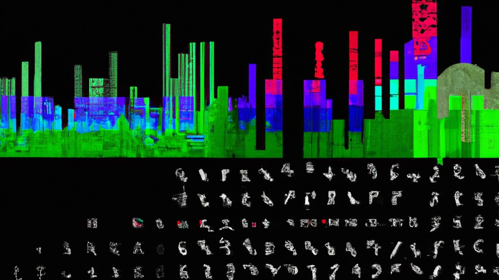

# A benchmark toward an end-to-end machine learning system for acoustic monitoring of wildlife populations and ecosystems

<div align="center">

</div>

Current passive acoustic monitoring datasets focus on single species, limiting their use for conservation and policy. We propose collaborating with biologists and computer scientists to create a comprehensive benchmark covering various species. Standardized annotations, preprocessing, and baseline models will bridge this gap for a general ecosystem and animal population assessment system.

Check more information [here](https://experiment.com/projects/a-benchmark-toward-an-end-to-end-machine-learning-system-for-acoustic-monitoring-wildlife-populations-and-ecosystems)

## Download


**[ESP Atlas Multi-taxonomic Annotation Protocol](https://github.com/jscanass/esp_atlas/blob/main/Protocolo_ESP_v1.pdf)** (Draft in Spanish)


**[Download the ESP Multi-taxonomic Dataset](https://zenodo.org/record/8342596/files/anuraset.zip?download=1)** (Forthcoming)

A more thorough dataset description is available in the original [paper](https://doi.org/10.1038/s41597-023-02666-2). (Forthcoming)


## Installation instruction and reproduction of baseline results (Forthcoming)

1. Install [Conda](http://conda.io/)

2. Clone this repository

```bash
git clone https://github.com/jscanass/esp_atlas/
```

3. Create an environment and install requirements

```bash
cd esp_atlas
conda create -n esp_env python=3.8 -y
conda activate esp_env
conda install pytorch torchvision torchaudio pytorch-cuda=11.6 -c pytorch -c nvidia
pip install -r requirements.txt
```

> **Notes**
> * The installation of dependencies where tested on Azure. If you want to run locally, you might have to change the way you install PyTorch. Check the [PyTorch official webpage](https://pytorch.org/get-started/locally/) for installation instruction on specific platforms.
> * For **macOS** you might need to install [chardet: The Universal Character Encoding Detector](https://pypi.org/project/chardet/) with pip.


4. Download the data directly from Zenodo 

5. Train 

```bash
python baseline/train.py --config baseline/configs/exp_resnet18.yaml
```

6. Inference

```bash
python baseline/evaluate.py --config  baseline/configs/exp_resnet18.yaml
```


## Citing this work (Forthcoming)

If you find this work useful for your research, please consider citing it as:


## Acknowledgments
The authors acknowledge financial support from the [ESP Grant](https://www.earthspecies.org/blog/new-grants-to-catalyze-research-into-ai-and-non-human-communication)


